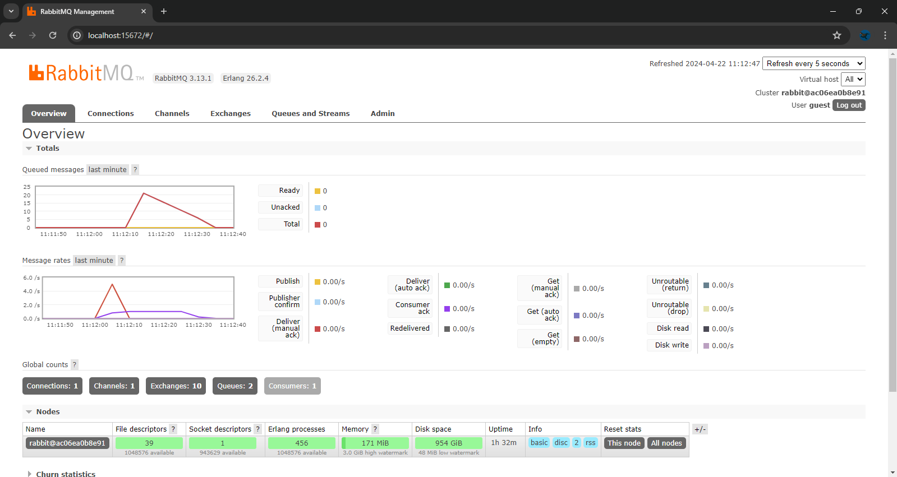
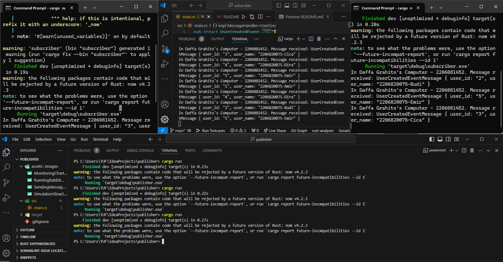
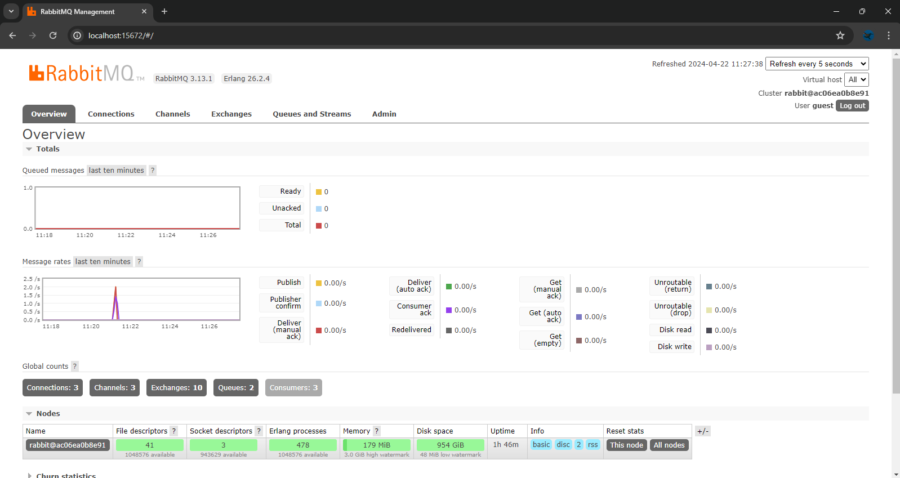

### What is **amqp**?
    
amqp atau Advanced Message Queuing Protocol (AMQP) adalah sebuah open standard application layer protocol untuk message-oriented middleware. AMQP dirancang untuk mendukung komunikasi yang handal, asinkron, dan aman *software components* yang terpisah.

Dalam konteks kode ini, AMQP digunakan untuk menghubungkan aplikasi ini dengan antrean pesan yang dipantau oleh `CrosstownBus` sehingga dapat mengirim dan menerima pesan dari antrean yang terhubung ke broker AMQP, dalam hal ini dijalankan lokal pada port 5672.
    

### What does **`guest:guest@localhost:5672`** mean? what is the first **guest**, and what is the second **guest**, and what is **`localhost:5672`** is for? 
   
`guest:guest@localhost:5672` menandakan connection string URI dalam format `<username>:<password>@<host>:<port>`:

1. `guest` yang pertama menandakan username pengguna yang dipakai untuk *authentication* di RabbitMQ server, biasanya default di RabbitMQ memang `guest` usernamenya.
2. `guest` kedua mewakili `password`nya. Di RabbitMQ, password defaultnya biasanya juga `guest`.
3. `localhost:5672` adalah hostname dan port number broker AMQP. Dalam kasus ini, localhost berarti broker berjalan pada mesin yang sama di mana kode dijalankan, dan 5672 adalah default port untuk komunikasi AMQP.

## Simulation slow subscriber:

Dari gambar tersebut terlihat bahwa Subscriber menjadi lambat dalam menerima data dari message broker yaitu dengan delay satu detik dalam setiap process. Queued messages pada message broker disini akan bertambah terus selagi bertambah juga delay karena Publisher dalam kasus ini akan lebih cepat daripada Subscriber sebagai penerima. Total banyak queue pada komputer saya disini adalah 20 dalam menjalakan 5 kali `cargo run` di Publisher.

## Reflection and Running at least three subscribers

Dari yang saya pahami, Jika terdapat banyak subscriber yang connect ke satu publisher maka pengiriman data ke message brokernya akan menjadi lebih cepat dan terdistribusi pada console yang connect juga tidak ada yang masuk ke dalam queued messages pada message broker. Jumlah subscribers yang terhubung dapat mempengaruhi kinerja, tetapi kecepatan pengiriman ke message broker juga dipengaruhi oleh faktor lain seperti network latency dan beban kerja message broker.